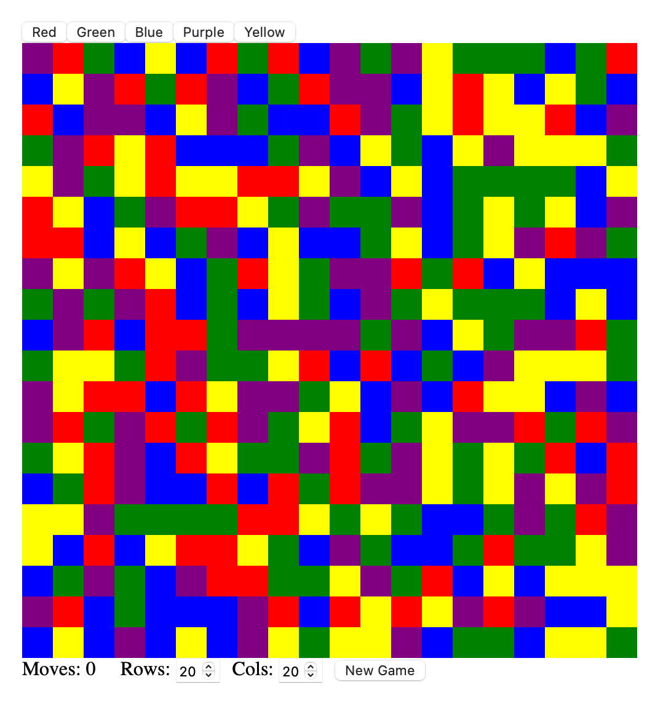

# Elm-Grid-game 

## Overview
This project recreates a color-flood puzzle game in Elm, a purely functional language designed for building safe, interactive web apps. The goal of the game is to fill the entire grid with one color in the fewest moves possible.( similar to - http://www.flashbynight.com/drench/ )

## Steps to Run the Elm Drench Game
1. Install Elm
   ```
   npm install -g elm

   ```

   check that it worked:
   ```
    elm --version
   ```
2. Install elm-live
   ```
   npm install -g elm-live

   ```
3. Run the code
   ```
   elm-live main.elm --port=8001 --open -- --output=elm.js
   ```

Should load a url-


## Why did i choose elm?
- No runtime errors: the compiler catches mistakes early
- Pure functions: every update is predictable and testable
- Strong typing: helps prevent invalid states
- Great for UI: uses declarative HTML similar to React, but simpler


